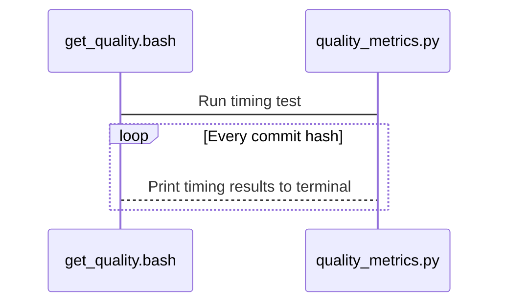

# floris_metrics
Performance and test coverage metrics for FLORIS

## Structure

This tool consists of a bash script and a Python script. The bash script lists all
of the commits to include in the timing results and executes the Python script.
The Python script defines a set of FLORIS cases, creates the input data, and
prints the timing results.



## How to use

Software performance profiling can be tricky since modern operating systems
typically have many processes running concurrently. This tool runs the timing
tests a number of times and reports the average. The results can be used
to understand the performance impacts of changes over commits. In FLORIS,
this is used in a
[notebook](https://github.com/NREL/floris/blob/main/docs/code_quality.ipynb)
that is included directly in the
[documentation](https://nrel.github.io/floris/code_quality.html).

To use with FLORIS, this directory must be parallel to the FLORIS directory:
```
.
├── floris
└── floris_metrics
```

Add more data points by listing new commits to the bottom of the list in the
bash script. Then, run the bash script with this command from the parent
directory of both FLORIS and FLORIS_Metrics:

```
>> $ ls
floris/           floris_metrics/
>> $ bash floris_metrics/get_quality.bash
```

The timing results are printed to the terminal window in a format similar to
what is used in the FLORIS notebook linked above.
